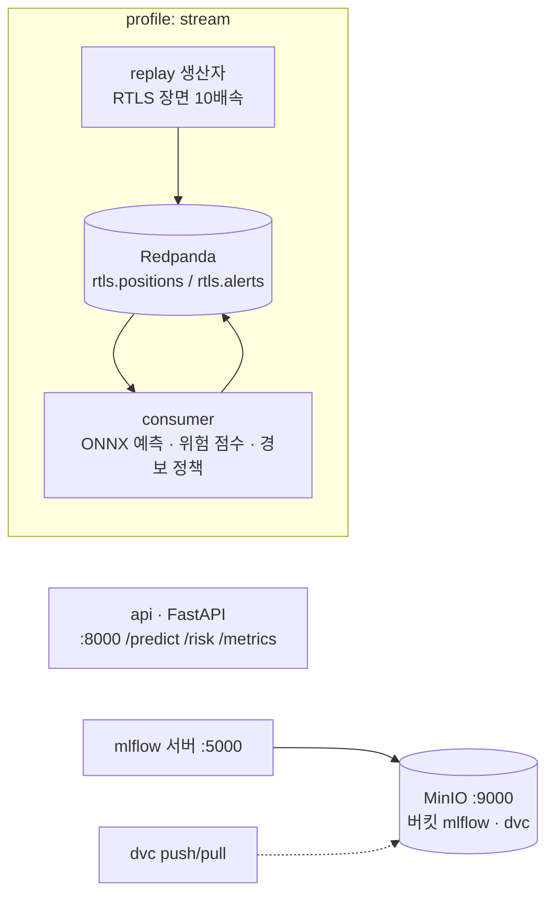

# Docker Compose 토폴로지



| 서비스 | 역할 | 포트 |
|---|---|---|
| `api` | 서빙 이미지(`Dockerfile` target `serve`), ONNX 백엔드, 헬스체크 `/health` | 8000 |
| `mlflow` | 실험 추적 서버. 백엔드 SQLite(볼륨), 아티팩트 `s3://mlflow/` (MinIO) | 5000 |
| `minio` + `minio-init` | S3 호환 저장소, 버킷 `mlflow`·`dvc` 자동 생성 | 9000 / 9001 |
| `redpanda` | Kafka API 브로커 1노드 (프로파일 `stream`) | 9092 |
| `replay` / `consumer` | 재생 생산자 / 스트리밍 소비자 (프로파일 `stream`) | – |

```bash
docker compose up --build -d                  # api + mlflow + minio
docker compose --profile stream up -d         # + redpanda + replay + consumer
MLFLOW_TRACKING_URI=http://localhost:5000 foresight train dataset=eth train=smoke   # 서버형 추적으로 학습
dvc remote modify storage endpointurl http://localhost:9000 && dvc push                 # 데이터를 MinIO 로
```

정직한 한계: 브로커 1노드·복제 없음·인증 없음. 실제 배치에서는 Confluent Cloud(회사 파트너) 또는 MSK, 그리고 `deploy/terraform` 의 ECS 서비스로 옮긴다.
