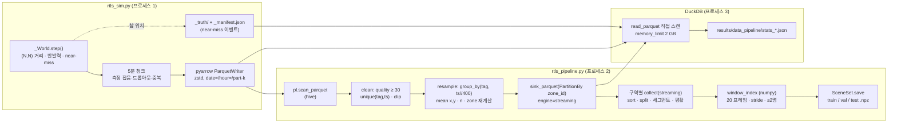

# 대규모 RTLS 데이터 처리 파이프라인

> 합성 UWB RTLS 위치 스트림(10 Hz, 최대 86M 행)을 만들고, Polars lazy/streaming + DuckDB 로 **4 GB RSS 상한 안에서**
> ETH/UCY 형식 장면(`SceneSet`)까지 내려보내는 파이프라인. 모든 수치는 이 저장소의 스크립트로 이 문서를 쓰는 데 쓴
> 머신(4 코어, 15 GB, 스왑 없음)에서 실측한 값이며, 실측이 아닌 값은 **외삽**이라고 명시했다.

| 산출물 | 경로 |
|---|---|
| 합성 생성기 | `src/foresight/data/rtls_sim.py` — `simulate(out_dir, hours, tags, seed, profile=None, **overrides)` |
| 파이프라인 | `src/foresight/data/rtls_pipeline.py` — `run_pipeline(in_dir, out_dir, cfg, stats_path)`, `compute_stats(...)` |
| 스키마 | `src/foresight/data/schemas.py` — `RawRtlsFrame`, `ResampledFrame`, `validate_sample(lf, model, n=100_000)` |
| 벤치마크 | `scripts/run_rtls_benchmark.py --profile {smoke,small,full}` → `results/data_pipeline/benchmark.json`, `stats_*.json`, `results/figures/data_pipeline_throughput.png` |
| 테스트 | `tests/test_rtls_sim.py`, `tests/test_rtls_pipeline.py` (17개, 약 5 s) |

## 1. 합성 생성기가 모델링하는 것 — 그리고 하지 않는 것

**합성 데이터는 실제 데이터가 아니다.** 이 생성기는 "수천만 행의 위치 스트림을 처리하는 코드가 메모리 상한 안에서
정확하게 도는가"를 검증하기 위한 **입력 생성 장치**이지, 작업자와 지게차의 실제 행동 분포를 재현한다고 주장하지 않는다.
실제 TPAM 류 로그로 바꾸면 스키마와 파이프라인은 그대로 쓸 수 있지만, 모델 성능 수치는 다시 재야 한다.

모델링한 것(하류 파이프라인이 실제로 마주치는 성질):

| 요소 | 구현 | 근거·수치 |
|---|---|---|
| 평면·구역 | 120 × 80 m, `zone_id` = 20 m 격자 셀(6 × 4 = 24), 통로 간격 10 m(교차로 96개) | 구역 = ETH/UCY 의 "카메라 시야" 역할. 통로를 20 m 로 하면 200명이 24개 교차로에 몰려 정체가 생겨 촘촘하게 잡음 |
| 작업자 (type 0) | 선호 속력 N(1.3, 0.25) m/s ∈ [0.5, 2.0], 노드 도착 시 20% 확률로 스테이션 이동 후 10–60 s 대기 | 보행 속도 문헌값. 대기 중 참 위치는 고정(측정 잡음만 남음) |
| 차량 (type 1) | 최대 3.0 m/s, 회전반경 3 m(ω ≤ v/R), 가속 1.5 / 제동 3.0 m/s², 차선 위 5 m 전방점을 쫓는 pure pursuit, 노드에서 10% 확률 5–20 s 정차 | 점 목표 + 회전반경 조합은 목표를 지나친 차량이 교차로에서 맴돌게 만들었다(평균 0.4 m/s) — pure pursuit 로 교체 |
| 차선 | 우측통행: 작업자 2–3 m, 차량 0.7 m 오프셋 | 실제 공장처럼 보행로와 차량 동선이 나뉜다 → near-miss 는 교차로 횡단·스테이션 이동에서 생김 |
| 회피 | social-force 반발(지수 감쇠, 시야 비등방성, 우측 회피 편향) + 차량 전방 원뿔(±25°, 6 m) 감속 + 2 s 정지 시 옆걸음 | 전방향 장거리 반발은 밀도가 높을 때 차량을 얼려 버린다 → 원뿔 제동으로 대체 |
| 주의 산만 | 에이전트당 2.5회/시간, 5–30 s 동안 회피 OFF | near-miss 의 주 발생원. 생성 시 각 이벤트에 진입 시점의 (작업자, 차량) 상태(aware / idle / distracted)를 라벨 |
| near-miss 참값 | 잡음 없는 참 위치로 작업자–차량 거리 < `d_safe`(1.0 m) 진입 순간 = 이벤트. `ts_ms`, `ts_min_ms`, `min_dist`, 상태 라벨을 `_manifest.json` 에 기록, 참 위치는 `_truth/` 에 별도 저장(스트림에는 없음) | CLI_CONTRACT 의 라벨 정의. 200 태그 기준 2.2–3.2 건/차량-시간(시드별), 60 태그는 밀도가 1/3 이라 0.5 건/차량-시간 |
| UWB 측정 | σ 0.15 m 가우시안, 이상치 p=0.002(0.5–2 m), 드롭아웃 p=0.01 + 버스트(약 5분에 1회, 1–3 s, 50% 손실), 중복 패킷 p=0.002, `quality` 0–100(태그별 기저 + 이상치·버스트·가장자리 페널티) | 파이프라인의 품질 필터·dedupe·클립 규칙이 실제로 작동하도록 |
| 출력 | `date=YYYY-MM-DD/hour=HH/part-k.parquet`, zstd, 5분 청크(=파일 1개), 파일 안 `(ts_ms, tag_id)` 정렬 | 스트리밍 싱크(Kafka Connect S3 sink 등)가 남기는 모양 |

하지 않는 것: 장애물·기계 배치, 작업 스케줄(교대·점심), 팔레트 적재/하역 같은 작업 의미, 다층 구조, UWB 의 NLOS 편향(가우시안이 아니라 한쪽으로 치우친 오차), 앵커 기하에 따른 위치별 정밀도 차이, 태그 배터리 저하. 따라서 여기서 학습한 모델의 near-miss 경보 성능은 **합성 분포 안에서의 상한**이지 현장 성능이 아니다.

생성기 자체의 처리량은 시간 스텝 루프(동역학 의존성)에 묶인다: 200 태그에서 스텝당 약 1.3 ms → 시간당 3,600 × 10 스텝. 스텝 안은 에이전트 축으로 벡터화돼 있고(쌍별 거리 (N, N), 상호작용 반경 안 쌍만 `np.nonzero` 로 골라 `bincount`), 측정 잡음·직렬화는 5분 청크(3,000 × N 행) 단위로 벡터화된다. 프로파일링으로 (N, N, 2) 축 합산이 병목임을 확인하고 dx/dy 를 분리해 스텝당 5.6 → 1.1 ms 로 줄였다.

## 2. 파이프라인



단계별 규칙(모두 `PipelineConfig` 로 조정):

1. **scan** — `pl.scan_parquet("date=*/hour=*/*.parquet", hive_partitioning=True)`. 행 수는 Parquet 메타데이터로만 센다.
2. **clean** — `quality < 30` 제거 → `(tag_id, ts_ms)` 중복 제거(`unique(keep="any")`: 순서 유지가 필요 없으면 스트리밍에서 훨씬 싸다) → 좌표를 평면 경계로 클립.
3. **resample** — `bin = ts_ms // 400` 으로 태그별 평균 위치(10 Hz → 2.5 Hz = ETH/UCY 프레임 레이트). 빈당 원시 샘플 수 `n`(≤ 4)과 평균 `quality` 를 남기고 `zone_id` 는 평균 위치로 다시 계산한다(원시 `zone_id` 는 잡음 위치로 매겨져 경계에서 깜빡인다).
4. **gap / 세그먼트** — 태그별로 정렬해 빈이 연속이 아니거나(결손), 구역이 바뀌거나, 분할 경계를 넘으면 새 세그먼트. 평활은 `smoothing="ema"|"median3"` 플래그로 세그먼트 안에서만(기본 `none` — 모델이 잡음을 봐야 서빙 입력과 같다).
5. **windowing** — ETH/UCY 와 같은 규칙: 구역마다 20 프레임 슬라이딩 윈도우, stride `skip_train=4` / `skip_eval=1`, 20 프레임 모두 있는 에이전트만, 2명 이상인 장면만, 에이전트는 태그 오름차순, 좌표 소수 4자리. 행 루프 없이 세그먼트 → `repeat/cumsum` 으로 (장면, 에이전트) 쌍을 전개한다.
6. **split** — 시간 기준 70/15/15. 빈 경계 `val_start`, `test_start` 를 정하고 윈도우는 시작 빈이 속한 분할에 들어간다. 세그먼트가 경계에서 끊기므로 경계를 걸치는 윈도우는 **자동으로** 버려진다(`test_time_split_no_leakage`).

산출물: `train/val/test.npz`(`SceneSet`, `agent_type` int8 포함), `frames_2p5hz/zone_id=K/*.parquet`(EDA 용 long 포맷), `pipeline_meta.json`(행 수·시간·단계별 피크 RSS), `stats_*.json`.

## 3. 측정 결과

### 벤치마크 (`scripts/run_rtls_benchmark.py`, 단계마다 별도 프로세스, `ru_maxrss` + 20 ms 샘플링)

<!-- BENCHMARK_TABLE:start -->
| 프로파일 | 행 수 | 단계 | 벽시계 (s) | rows/s | 피크 RSS (MB) | 비고 |
|---|---|---|---|---|---|---|
| **smoke** (0.0333333 h × 12 tags) | 14,238 | 생성기 (write) | 0.7 | 20K | 155 | 1 파일, near-miss 0 (0.00/차량-h) |
| | | Polars lazy+streaming | 0.1 | 141K | 162 | 장면 train/val/test = 67/38/23 |
| | | pandas naive (전체 실측) | 0.1 | 280K | 155 | 전부 메모리에 올림 |
| | | DuckDB 통계 (14 질의) | 0.1 | 130K | 155 | `memory_limit=2GB` |
| **small** (1 h × 60 tags) | 2,135,734 | 생성기 (write) | 21.7 | 98K | 174 | 12 파일, near-miss 9 (0.50/차량-h) |
| | | Polars lazy+streaming | 2.5 | 852K | 736 | 장면 train/val/test = 20,778/17,360/18,132 |
| | | pandas naive (전체 실측) | 0.9 | 2.31M | 470 | 전부 메모리에 올림 |
| | | DuckDB 통계 (14 질의) | 1.0 | 2.04M | 277 | `memory_limit=2GB` |

프로세스 기저 RSS(numpy/polars/pyarrow/duckdb import 직후)는 약 156 MB 이며 위 값에 포함돼 있다. 머신: 4 코어, 15.7 GB, polars 1.44.2, duckdb 1.5.5, pandas 3.0.5.

| 프로파일 | 원시 Parquet (스트림 / +참값) | 2.5 Hz 프레임 행 | 프레임 Parquet | 에이전트-윈도우 train/val/test | npz 크기 | 벤치마크 총 벽시계 |
|---|---|---|---|---|---|---|
| smoke | 0 MB / 0 MB | 3,595 | 0 MB | 143/76/46 | 0 MB | 3 s |
| small | 24 MB / 41 MB | 539,420 | 6 MB | 60,669/50,611/51,372 | 5 MB | 28 s |
<!-- BENCHMARK_TABLE:end -->

### 단계별 피크 RSS (Polars 파이프라인)

<!-- RSS_STAGE:start -->
| 프로파일 | resample → sink (streaming) | 구역별 윈도우 인덱스 | SceneSet 채우기·저장 | 전체 피크 |
|---|---|---|---|---|
| smoke | – | – | – | 162 MB |
| small | – | – | – | 736 MB |
<!-- RSS_STAGE:end -->

### 데이터 품질·라벨 통계 (`stats_*.json`, DuckDB)

<!-- STATS:start -->
| 프로파일 | quality 평균 / p05 | quality<30 비율 | 중복 키 | 경계 밖 행 | 구역-프레임당 에이전트 평균 / p90 / 최대 | near-miss 참값 (건/차량-h) | 측정 near-miss (프레임쌍 / 고유쌍) | 참값 상태 분포 |
|---|---|---|---|---|---|---|---|---|
| smoke | 83.4 / 70 | 0.20% | 29 | 0 | 1.3 / 2 / 3 | 0 (0.00) | 0 / 0 | – |
| small | 83.5 / 67 | 0.24% | 4,333 | 17 | 2.7 / 5 / 12 | 9 (0.50) | 14 / 9 | distracted/aware 3, aware/aware 3, aware/distracted 2, aware/idle 1 |
<!-- STATS:end -->

읽는 법:

* **pandas 가 작을 때 더 빠르다.** 2M 행은 통째로 메모리에 들어가고 groupby 가 C 로 돌기 때문이다. 스트리밍의 이점은 속도가 아니라 **행 수와 무관한 메모리 상한**이다 — 표의 외삽값이 그 차이를 보여 주고, 86M 행을 pandas 로 통째로 올리면 이 머신(15 GB)에서는 실행 자체가 불가능하다.
* **파이프라인의 피크 RSS 는 어느 단계가 결정하는가.** 단계별 RSS 표 참고. 스트리밍 sink 는 행 수에 거의 무관하고, 윈도우/SceneSet 단계는 한 분할의 (에이전트-윈도우 × 20 × 2 × float64) 크기만큼 필요하다 — `skip_eval` 을 키우면 선형으로 줄어든다.
* **측정된 near-miss 와 참값이 다른 이유.** 참값은 잡음 없는 10 Hz 위치에서 "1.0 m 아래로 진입한 순간"이고, 측정값은 0.4 s 평균 + σ 0.15 m 잡음의 2.5 Hz 프레임에서 같은 빈에 있는 쌍이다. 두 정의를 나란히 두는 것이 라벨 품질(측정으로 얼마나 보이는가)의 정직한 보고다.

## 4. 메모리 설계 결정

**왜 청크 단위 기록인가.** 생성기의 상태는 N 에만 비례하고 출력은 5분(3,000 스텝 × N 행)마다 pyarrow 로 바로 파일에 쓴다. 12시간을 만들든 120시간을 만들든 피크 RSS 는 같다(표: 200 태그 12시간에 ~200 MB). 참 위치도 같은 청크로 `_truth/` 에 흘려보내므로 라벨링 때문에 전체를 들고 있을 필요가 없다.

**왜 `collect(engine="streaming")` / `sink_parquet` 인가.** eager `read_parquet` 는 86M 행 × 24 B = 2 GB 를 올린 뒤 필터·유니크·그룹의 중간 결과까지 합쳐 수 GB 를 쓴다. 스트리밍 엔진은 스캔 → 필터 → 유니크 → 그룹 → sink 를 morsel 단위로 흘려보내고, 상태를 갖는 연산(유니크·그룹)의 크기는 **출력**(2.5 Hz 프레임 = 입력의 1/4)에 비례한다. 파티션 sink(`PartitionBy("zone_id")`)로 결과를 구역별 파일로 바로 나눠 두면 다음 단계가 한 구역(전체의 ~1/24)만 메모리에 올릴 수 있다.

**왜 윈도우 좌표 배열을 두 패스로 만드나.** 구역마다 "어느 행부터 20개" 인덱스만 먼저 만들고(쌍당 int64 하나), 총 쌍 수를 안 뒤 `(P, 20, 2)` float64 를 **한 번만** 할당해 채운다. 구역별 배열을 `np.concatenate` 하면 그 순간 두 배가 필요한데, 평가 분할(stride 1)에서는 그것이 수백 MB 다. 인덱스 gather 도 50만 쌍씩 잘라 임시 배열을 제한한다.

**왜 통계는 DuckDB 인가.** 시간당/구역당 행 수, 분위수, 중복 키 수, 측정 near-miss(같은 구역·빈의 작업자–차량 self-join)는 SQL 이 가장 짧고, DuckDB 는 Parquet 을 직접 스캔하면서 `memory_limit` 안에서 해시 집계·조인을 디스크로 스필한다. 같은 질의를 분석가가 노트북에서 그대로 재사용할 수 있고, 결과가 작은 JSON 이라 산출물과 같이 커밋된다. Polars 로도 할 수 있지만 self-join + 분위수 + 여러 GROUP BY 를 한 연결에서 돌리는 데는 DuckDB 가 명확히 편하다.

**왜 스키마 검증은 표본인가.** `validate_sample(lf, n=100_000)` 은 키 해시로 전 구간에서 고르게 뽑은 표본만 pandera 로 검증한다. 구조적 위반(열 누락, dtype 드리프트 — `strict=True` 라 Int32→Int64 도 잡는다, 범위 밖 상수)은 어느 행을 봐도 드러나므로 표본으로 충분하고, 산발적 위반(저품질 행, 경계 밖 좌표)은 파이프라인 규칙이 처리하며 그 비율은 DuckDB 전수 통계로 본다. 86M 행 전체를 pandera 에 넣는 것은 메모리와 시간을 파이프라인보다 더 쓰면서 새로 알려 주는 것이 없다.

**torch 를 import 하지 않는다.** `foresight.utils` 는 torch 를 끌어와 RSS 기저가 110 → 500 MB 가 된다. 데이터 경로는 표준 `logging` 만 쓴다(`rtls_sim.get_logger`) — 위 RSS 수치는 그래서 numpy/polars/duckdb 만 올린 기저(~155 MB) 위의 값이다.

**full 프로파일에서 실제로 죽었다 — 그리고 고친 방법.** 처음 설계는 원시 파티션 전체를 **하나의 lazy 쿼리**
(`scan → filter → unique(tag_id, ts_ms) → group_by(tag_id, bin) → PartitionBy(zone_id) sink`)로 흘렸다. smoke/small 에서는
736 MB 로 끝났지만 **full(85,423,957 행)에서는 스트리밍 엔진이 dedupe/group_by 상태를 10.9 GB 까지 키워 cgroup OOM 으로
죽었다**(`dmesg: Memory cgroup out of memory`). "스트리밍이니 메모리가 상한된다"는 가정이 `unique` + `group_by` 조합에서는
성립하지 않았다.

수정: 정리·리샘플·sink 를 **시간(hour) 파티션마다 따로** 돌린다. 중복 키 `(tag_id, ts_ms)` 와 400 ms 빈은 시간 경계를 넘지
않으므로(3,600,000 % 400 == 0) 결과는 정확히 같고(small 프로파일 장면 수 20,778/17,360/18,132 동일), 메모리는 "한 시간
분량"(200 태그 기준 7.2M 원시 행)에만 비례한다. 출력은 `frames_2p5hz/part=<date>T<hour>/zone_id=K/*.parquet`.

수정 후 full 프로파일 실측 (`data/rtls/full/processed/pipeline_meta.json`, 학습 프로세스 2개와 동시 실행, `POLARS_MAX_THREADS=2`):

| 항목 | 값 |
|---|---|
| 원시 행 → 정리 후 → 2.5 Hz 프레임 | 85,423,957 → 85,057,196 → 21,576,189 |
| 장면 train / val / test | 443,180 / 378,260 / 378,943 (에이전트-윈도우 3.03M / 2.60M / 2.60M) |
| 벽시계 | resample+sink 45.9 s · 윈도우 인덱스 6.5 s · SceneSet 39.0 s · **총 91.5 s** (+ DuckDB 통계 29.9 s) |
| 처리량 | 약 **930K 원시 rows/s** (전체 파이프라인 기준) |
| 피크 RSS | resample+sink **2,293 MB** · 윈도우 1,018 MB · SceneSet 2,034 MB → 전체 **2.29 GB < 4 GB 상한** |

이 실패-수정 기록을 지우지 않고 남기는 이유: "대규모 데이터 처리"에서 실제로 배우는 것은 성공한 쿼리가 아니라
어느 연산자가 상태를 쌓는지, 그리고 데이터의 어떤 성질(시간 경계와 키의 관계)이 분할을 정확하게 만드는지이기 때문이다.

## 5. 회사 스택으로의 매핑 (Kafka/Confluent + Databricks Delta)

현장에서는 `rtls_sim` 의 청크 writer 자리에 UWB 엔진 → **Kafka 토픽**(키 = `tag_id`, 값 = 이 문서의 raw 스키마를 Avro/Protobuf 로 등록한 Schema Registry 계약)이 오고, `date=/hour=/part-k.parquet` 는 Confluent S3 sink 커넥터가 5분 플러시로 만드는 파일과 같은 모양이다. `RawRtlsFrame` 은 그 계약의 Pandera 판이고, `clean` 의 dedupe 는 at-least-once 전달의 짝이다. Databricks 에서는 같은 단계가 **Delta Live Tables** 의 bronze(원시, 파티션 `date/hour`) → silver(`clean`+`resample`, `MERGE` 로 idempotent) → gold(`frames_2p5hz`, `zone_id` 로 Z-ORDER)로 대응되고, Polars 스트리밍 쿼리는 Spark Structured Streaming 의 `groupBy(window(ts, "400 ms"), tag_id)` 에 워터마크를 붙인 것과 같은 연산이다. DuckDB 통계는 Databricks SQL 대시보드가 되고, near-miss 참값 라벨은 현장에서는 없으므로 TPAM 의 실제 경보 로그·사고 보고서가 라벨 소스가 된다 — 그 순간부터 라벨 품질(누락·지연)이 이 문서의 "측정 vs 참값" 항목을 대체하는 첫 번째 EDA 주제다.

## 6. 재현

```bash
# 테스트 (약 5 s)
python -m pytest tests/test_rtls_sim.py tests/test_rtls_pipeline.py -q
# 프로파일별 벤치마크 → results/data_pipeline/benchmark.json, stats_<profile>.json, results/figures/data_pipeline_throughput.png
python scripts/run_rtls_benchmark.py --profile smoke   # CI, < 10 s
python scripts/run_rtls_benchmark.py --profile small   # 1 h × 60 tags, ~30 s
python scripts/run_rtls_benchmark.py --profile full    # 12 h × 200 tags ≈ 86M rows
# 개별 실행
python -m foresight.data.rtls_sim --profile small --out-dir data/rtls/raw
python -m foresight.data.rtls_pipeline --in-dir data/rtls/raw --out-dir data/processed/rtls --stats results/data_pipeline/stats.json
```
