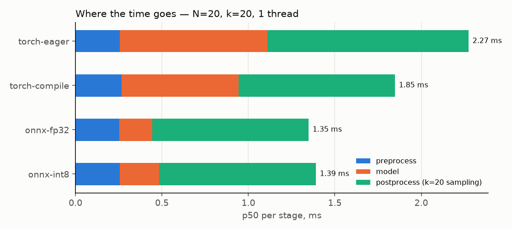
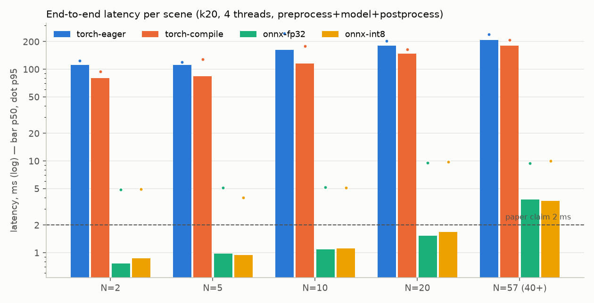

# 추론 최적화 — ONNX / INT8 / torch.compile / 전처리 벡터화 벤치마크

> 코드: `src/foresight/inference/{export,quantize,onnx_backend,benchmark}.py` · 결과: `results/benchmark.json`,
> `results/figures/benchmark_*.png`, `artifacts/onnx/manifest.json` · 재현: `foresight export && foresight benchmark`
> (`--quick` 는 CI 용, 약 45 s).

## 0. 결론 먼저

| 질문 | 답 (이 머신, CPU 4 vCPU, 1 스레드, 전처리+모델+후처리 포함) |
|---|---|
| 가장 빠른 백엔드 | **ONNX Runtime fp32** — N=2 에서 k=0 0.27 ms / k=20 0.72 ms, N=57 에서 1.5 / 3.0 ms. eager 대비 모델 구간 4.5 배(0.85 → 0.19 ms @N=20), 전체 1.7~2.2 배 |
| INT8 정적 양자화 | **속도 이득 없음** (fp32 보다 10~20 % 느림), 정확도 ADE +0.04 (TXP-CNN 만) ~ +0.09 (전체). 7.6K 파라미터 모델은 연산량이 너무 작아 Q/DQ 오버헤드가 절약분을 넘는다 → 서빙 기본값은 fp32 |
| torch.compile | eager 대비 약 20 % (1.55 → 1.19 ms @N=2). 첫 컴파일 16.8 s, 동적 N 은 `dynamic=True` 로 재컴파일 없이 처리. 이 빌드(2.14+cu130, CPU)에서 실패 없음 |
| 스레드 | **1 스레드가 최선**. torch 4 스레드는 기본(OMP 스핀 대기)에서 **100 배 느려짐**(1.55 → 112 ms); `OMP_WAIT_POLICY=PASSIVE` 로 2 ms 대 복구. ORT 4 스레드는 p50 은 같고 p95 꼬리만 5~10 ms 로 길어짐 |
| 병목 | k=20 이면 **후처리(20 샘플 추출, torch)** 가 0.9 ms 로 전체의 2/3. 모델은 0.19 ms, 전처리 0.25 ms |
| 전처리 벡터화 | 공식 코드(파이썬 이중 루프 + networkx) 대비 **numpy 브로드캐스트 ×100** (N=20: 17.3 → 0.17 ms, N=57: 94.3 → 1.0 ms), 결과 차이 < 1.5e-6 |
| 논문 주장 | 0.002 s/frame, 7.6K 파라미터 → 우리는 7,563 파라미터 그대로, CPU 1 스레드 fp32 로 N≤20 이면 **2 ms 이내 (k=20 포함)**, N=57 이면 3 ms |
| 스트리밍 예산 | 구역(N=10, k=20, 위험 계산 포함) 당 1.6 ms p95 → 소비자 하나가 2.5 Hz 프레임 안에 **~248 구역** |

측정 환경의 주의: 벤치마크 실행 중 같은 4 vCPU 에서 **학습 프로세스 3 개(각 1 스레드)가 돌고 있었다**
(`meta.concurrent_training_processes = 3`, load average 3.3 → 6.5). 1 스레드 수치는 남은 코어에서 잰 것이라
안정적이지만, 4 스레드 수치는 코어 경합이 더해진 값이다 — 상대 비교(백엔드 간, 스레드 정책 간)는 유효하고
절대값은 유휴 머신에서 더 낮게 나온다. `meta.load_avg_*` 에 남겨 두었다.

## 1. 무엇을 했나

### 1.1 ONNX 내보내기 (`export.py`)

* `torch.onnx.export(dynamo=True, opset 18)` — torch.export 기반이라 `einsum` → `Einsum`, `.view` → `Reshape` 한 노드로
  옮겨져 **22 노드** 그래프가 나온다(Add·BatchNormalization·Conv·Einsum·PRelu·Reshape). 레거시 TorchScript 경로는
  Shape/Gather/Concat 이 끼어 64 노드. dynamo 가 실패하면 레거시(opset 17)로 폴백하고 사유를 매니페스트에 남긴다.
* 동적 축: `v (1, 2, 8, N)`, `a (8, N, N)` → `params (1, 5, 12, N)`. `torch.export.Dim("N", 1..1024)`.
* 이 torch 버전은 `external_data=True` 가 기본이라 가중치가 `.onnx.data` 로 분리된다 — 24 KB 짜리 모델에 파일 두 개는
  배포만 불편하므로 `external_data=False` 로 한 파일(57.8 KB)로 묶는다.
* 검증: `onnx.checker(full_check)` + **실제 테스트 장면 122 개**(ETH 전체 N=2~5, UNIV N 별 1 장면 3~57)에서 torch 와
  최대 절대 오차 **2.4e-6** (허용 1e-4). 난수 입력은 라플라시안 분포가 실제와 달라 검증으로 부족하다.
* `manifest.json`: 원본 체크포인트 경로·sha256, 파라미터 수 7,563, 각 파일 sha256·크기, opset·exporter, 패리티 결과,
  INT8 정확도 표.

### 1.2 정적 INT8 양자화 (`quantize.py`)

* **동적 양자화는 쓸모없다**: `quantize_dynamic` 은 MatMul/Gemm/LSTM 만 바꾸고 **Conv 를 건드리지 않는다**.
  이 모델은 1×1 Conv(GCN) + (3,1) 시간 Conv + 3×3 TXP-CNN Conv 5 개가 전부라 정적 양자화만 의미가 있다.
* `quant_pre_process`(BN 접기·상수 접기) → `quantize_static(QDQ, per_channel, 활성 uint8 / 가중치 int8, MinMax)`.
  보정은 ETH 학습 분할 무작위 200 장면을 서빙과 같은 `preprocess` 로 만든 (v, a).
* Entropy/Percentile 보정은 **동적 N 에서 실패**한다 — ORT 가 장면별 텐서를 `np.array(list)` 로 쌓다가 ragged shape 오류.
  MinMax 만 가능. (고정 N 으로 패딩하면 되지만 그러면 라플라시안 통계가 달라진다.)
* 두 변형을 만들어 ETH 테스트(70 장면, 181 보행자)로 비교하고 나은 쪽을 `social_stgcnn_int8.onnx` 로 둔다:

| 모델 | 결정적 μ ADE / FDE | best-of-20 (seed 0) ADE / FDE | Δ ADE (det / bo20) | 양자화 노드 | 크기 |
|---|---|---|---|---|---|
| fp32 ONNX | 0.988 / 1.804 | 0.718 / 1.187 | – | – | 57.8 KB |
| INT8 전체 (22 노드) | 1.077 / 1.879 | 0.793 / 1.259 | **+0.089 / +0.075** | 22 | 49.1 KB |
| INT8 TXP-CNN 만 (ST-GCNN 8 노드 제외) ✔ | 1.026 / 1.875 | 0.752 / 1.258 | **+0.038 / +0.034** | 14 | 43.8 KB |

  ST-GCNN 블록을 제외하면 손실이 절반 이하로 준다. 입력이 상대 변위(대개 ±0.5 m)이고 Einsum 으로 정규화
  라플라시안을 곱하는 구간이라 8-bit 격자(uint8 256 단계)가 보행자 간 미세한 속도 차이를 뭉갠다.
  TXP-CNN 은 12 채널짜리 시간 외삽이라 상대적으로 둔감하다.
* **그런데 INT8 이 fp32 보다 느리다** (N=20 모델 구간 0.19 → 0.23 ms, N=2 전체 0.72 → 0.84 ms). 이유: 연산량이
  너무 작다. N=20 에서 전체 MAC 이 수십만 개라 fp32 로도 0.2 ms 인데, INT8 은 노드마다 Quantize/Dequantize 커널이
  붙어 커널 호출 수가 늘고, per-channel 스케일 계산이 추가된다. VNNI 가 있어도 절약할 연산 자체가 없다.
  INT8 이 이기는 조건은 (a) 수백만 MAC 이상의 큰 Conv, (b) 배치 처리, (c) 메모리 대역폭 병목 — 셋 다 해당하지 않는다.
  **서빙 기본값은 fp32** 이고 INT8 은 "해 봤고 왜 안 되는지 안다" 는 기록으로 남긴다.

### 1.3 ORT 백엔드 (`onnx_backend.py`)

`OnnxPredictor(path, threads=1)` — `Predictor` 프로토콜, 전처리/후처리는 `predictor.py` 의 `preprocess`/`finalize`
를 그대로 재사용(백엔드가 바뀌어도 의미가 같아야 서빙·스트리밍에서 교체 가능). `intra_op_num_threads`,
`ORT_ENABLE_ALL`(Conv+BN 접기 등), `warmup()` 으로 N=2/10/40 를 미리 돌려 첫 호출의 메모리 계획 비용을 뺀다.

## 2. 측정 표 (`results/benchmark.json`)

조건: 실제 테스트 장면 (ETH N=2, 5 · UNIV N=10, 20, 57), 웜업 20 회, 측정 200 회(설정당 10 s 상한 — 4 스레드
torch 는 50~137 회에서 잘림, `n_iters` 에 기록), 배치 1, Intel Xeon 2.80 GHz 4 vCPU, torch 2.14 (CPU), ORT 1.30.
지연은 **전처리 + 모델 + 후처리** 의 벽시계 시간.

### 2.1 k=20 (평균 궤적 + 20 샘플, 서비스 기본) — p50 / p95 / p99 ms

| 백엔드 | N=2 | N=5 | N=10 | N=20 | N=57 |
|---|---|---|---|---|---|
| torch-eager /t1 | 1.55 / 1.64 / 1.65 | 1.70 / 1.79 / 1.82 | 2.00 / 2.30 / 2.80 | 2.32 / 3.16 / 3.56 | 4.10 / 5.78 / 6.42 |
| torch-compile /t1 | 1.19 / 1.32 / 1.36 | 1.30 / 1.42 / 1.45 | 1.50 / 1.59 / 1.60 | 1.88 / 1.98 / 2.04 | 3.58 / 3.93 / 4.22 |
| **onnx-fp32 /t1** | **0.72 / 0.80 / 0.93** | **0.90 / 0.98 / 1.09** | **1.08 / 1.47 / 1.55** | **1.40 / 1.49 / 1.55** | **3.01 / 3.28 / 3.97** |
| onnx-int8 /t1 | 0.84 / 1.06 / 1.28 | 0.93 / 1.02 / 1.13 | 1.09 / 1.20 / 1.25 | 1.45 / 1.55 / 1.81 | 3.19 / 3.89 / 4.40 |
| torch-eager /t4 (OMP 기본) | 112 / 124 / 134 | 112 / 120 / 144 | 162 / 245 / 265 | 180 / 204 / 250 | 208 / 239 / 266 |
| torch-compile /t4 (OMP 기본) | 80 / 94 / 111 | 84 / 128 / 150 | 115 / 179 / 185 | 148 / 164 / 166 | 180 / 207 / 241 |
| torch-eager /t4 + `OMP_WAIT_POLICY=PASSIVE` | 1.93 / 2.04 / 2.11 | 2.06 / 2.25 / 2.53 | 2.36 / 2.64 / 3.13 | 2.74 / 2.93 / 3.37 | 4.67 / 6.52 / 8.11 |
| onnx-fp32 /t4 | 0.76 / 4.85 / 9.02 | 0.98 / 5.08 / 5.39 | 1.09 / 5.18 / 5.36 | 1.53 / 9.57 / 9.95 | 3.79 / 9.39 / 11.33 |
| onnx-int8 /t4 | 0.87 / 4.94 / 6.52 | 0.95 / 4.00 / 6.38 | 1.11 / 5.10 / 5.36 | 1.68 / 9.75 / 12.57 | 3.65 / 9.96 / 12.97 |

처리량(scenes/s, k=20, 1 스레드): onnx-fp32 1,379 (N=2) → 328 (N=57); torch-eager 644 → 233; torch-compile 826 → 275.

### 2.2 k=0 (평균 궤적만, 결정적 위험 판정용) — p50 / p95 ms

| 백엔드 (1 스레드) | N=2 | N=5 | N=10 | N=20 | N=57 |
|---|---|---|---|---|---|
| torch-eager | 0.92 / 1.01 | 0.97 / 1.06 | 1.12 / 1.84 | 1.20 / 1.65 | 2.08 / 2.20 |
| torch-compile | 0.78 / 0.87 | 0.80 / 0.89 | 0.88 / 0.96 | 1.04 / 1.18 | 2.05 / 2.25 |
| **onnx-fp32** | **0.27 / 0.38** | **0.35 / 0.46** | **0.39 / 0.50** | **0.56 / 0.61** | **1.52 / 1.64** |
| onnx-int8 | 0.33 / 0.44 | 0.37 / 0.48 | 0.46 / 0.51 | 0.66 / 0.91 | 1.61 / 1.73 |

### 2.3 어디에 시간이 가나 (N=20, k=20, 1 스레드, p50 ms)

| 백엔드 | 전처리 | 모델 | 후처리 (20 샘플) | 합계 |
|---|---|---|---|---|
| torch-eager | 0.26 | 0.85 | 1.16 | 2.32 |
| torch-compile | 0.27 | 0.68 | 0.90 | 1.88 |
| onnx-fp32 | 0.25 | **0.19** | 0.91 | 1.40 |
| onnx-int8 | 0.26 | 0.23 | 0.91 | 1.45 |



* ORT 가 모델 구간을 0.85 → 0.19 ms 로 줄이자 **후처리가 병목**이 된다: `MultivariateNormal` 샘플링을 위한
  2×2 촐레스키 + `randn` + 배치 행렬곱 + 누적합이 torch 소형 텐서 연산 십여 개라 커널 호출 오버헤드가 지배적이다.
  k=0 이면 후처리는 0.06 ms.
* 전처리 0.25 ms 는 N=20 에서 (8, 20, 20) 라플라시안 계산 — 이미 벡터화된 값이고 N² 로 는다(N=57: 1.0 ms).

### 2.4 스트리밍 워크로드 — 프레임 하나에 Z=8 구역 (구역당 N=10, k=20, 작업자×차량 위험 포함)

| 백엔드 (1 스레드) | 프레임 p50 / p95 ms | 구역당 p95 ms | 2.5 Hz 예산(400 ms) 안 최대 구역 수 |
|---|---|---|---|
| torch-eager | 18.8 / 20.3 | 2.54 | 157 |
| torch-compile | 15.5 / 17.7 | 2.21 | 180 |
| **onnx-fp32** | **11.9 / 12.9** | **1.61** | **248** |
| onnx-int8 | 12.2 / 13.7 | 1.71 | 234 |

### 2.5 전처리: 공식 구현(networkx) vs 벡터화 numpy

| N | networkx 참조 (ms) | numpy (ms) | 배율 | 최대 절대 차이 |
|---|---|---|---|---|
| 20 | 17.27 | 0.173 | **×100** | 8.9e-8 |
| 57 | 94.26 | 1.002 | **×94** | 1.5e-6 |

참조 구현(`benchmark.networkx_seq_to_graph`)은 공식 `seq_to_graph` 를 그대로 옮긴 것: 프레임마다 보행자 쌍
이중 루프로 1/거리 를 채우고 `nx.normalized_laplacian_matrix(nx.from_numpy_array(A))`. 벡터화 버전은 `(T, N, N)`
브로드캐스트 한 번 + 차수 정규화. ETH 학습 분할(2,785 장면) 캐시 생성이 분 단위에서 초 단위가 된 것도 이 차이다.
스트리밍에서 이 값은 요청마다 드는 비용이라 "전처리를 지연에 포함" 하는 것이 정직한 벤치마크의 조건이다.

### 2.6 모델 파일

| 파일 | 크기 |
|---|---|
| PyTorch 체크포인트 (`state_dict`) | 36.9 KB |
| `social_stgcnn_fp32.onnx` | 57.8 KB (그래프 메타 + 7,563 파라미터 fp32) |
| `social_stgcnn_int8.onnx` (TXP-CNN 만) | 43.8 KB |
| `social_stgcnn_int8_full.onnx` | 49.1 KB |

파라미터가 7.6K 라 파일 크기는 어느 쪽도 문제가 아니다 — INT8 의 "4 배 작아짐" 은 여기서 30 % 에 그친다
(스케일·영점 텐서와 Q/DQ 노드 메타데이터가 가중치 절약분을 상쇄).

## 3. 스레드 이야기 — 왜 1 스레드인가



* **torch 4 스레드 = 100 배 느림** (N=2 k=20: 1.55 → 112 ms). 이 크기의 연산에서 OpenMP 가 매 op 마다 4 스레드를
  깨우고, 기본 스핀 대기(`OMP_WAIT_POLICY` 미설정 = ACTIVE 유사)가 4 vCPU 를 전부 점유한 채 서로를 기다린다.
  CPU 쿼터(`cpu.max = max`)와 무관하게 재현되며, 학습 프로세스 3 개가 도는 이 환경에서는 더 심하다.
  `OMP_WAIT_POLICY=PASSIVE` 로 **2.7 ms** (N=20, k=20) — 여전히 1 스레드(1.4 ms ORT / 2.3 ms eager)보다 느리다.
  결론: 이 모델을 torch 로 서빙한다면 스레드 1 + 워커 프로세스 N 이 맞고, 환경변수를 반드시 고정한다
  (`deploy/` 의 컨테이너 이미지 환경변수로 넣을 것).
* **ORT 4 스레드**: p50 은 1 스레드와 같지만 p95 가 0.8 → 4.8 ms, N=20 에서 9.6 ms 로 꼬리가 길어진다.
  ORT 는 스핀 대기 정책이 달라 100 배 병리는 없지만, 스레드풀 동기화 + 코어 경합이 꼬리로 나타난다.
  `intra_op_num_threads=1` 이 기본값인 이유.
* **ORT 백엔드에서도 torch 스레드를 고정해야 한다.** 후처리(샘플링)가 torch 라서, `OnnxPredictor` 는
  `torch_threads=1` 로 `torch.set_num_threads` 를 건다. 벤치마크 초기 실행에서 이 고정이 빠진 채 앞선 torch 4 스레드
  설정이 남아 "onnx/t4 k=20" 이 46~130 ms 로 잡혔고, 서빙에서도 같은 원인으로 핸들러 시간이 1.7 → 25 ms 였다.
  둘 다 고친 뒤의 수치가 위 표다.

## 4. 논문 주장과 비교

| 항목 | 논문 (Table 2) | 이 저장소 |
|---|---|---|
| 파라미터 | 7.6K | 7,563 (동일 — 공식 체크포인트 로드 검증) |
| 추론 시간 | 0.002 s/frame (하드웨어·배치·전처리 포함 여부 미명시) | CPU 1 스레드, 배치 1, **전처리·후처리 포함**: N≤20 이면 k=20 로도 ≤ 1.4 ms(ORT), 모델만이면 0.19~0.56 ms. N=57 이면 3.0 ms |

논문 수치가 GPU 인지 CPU 인지, 전처리를 넣었는지가 없어 등호 비교는 불가능하다. 말할 수 있는 것: 파라미터 수가
같은 모델을 CPU 에서, 전처리와 20 샘플 후처리까지 넣고도 논문의 2 ms 안에 들어온다는 점. 반대로 공식 코드의
전처리(networkx)를 그대로 쓰면 N=20 에서 전처리만 17 ms 라 "0.002 s" 는 모델 forward 만의 숫자일 가능성이 높다.

## 5. 시도했지만 채택하지 않은 것 / 한계

* **INT8**: 위 §1.2. 속도 이득 0, 정확도 −4~−9 %. 채택 안 함(파일은 남김).
* **Entropy/Percentile 보정**: 동적 N 에서 ORT 구현 오류. MinMax 만.
* **QOperator 포맷**: QDQ 와 정확도·속도 동일, 파일만 10 KB 작음. QDQ 유지(툴체인 호환 범위가 넓다).
* **torch.compile**: 20 % 이득에 16.8 s 콜드 컴파일(캐시 후 2.5 s). 서버 기동 지연과 `dynamic=True` 의 재컴파일 위험을
  감수할 만큼 빠르지 않다 — ORT 가 컴파일 없이 더 빠르다.
* **후처리 최적화 (미착수)**: 샘플링을 numpy 로 옮기고 2×2 촐레스키를 닫힌 식으로 바꾸면 0.9 → 0.1 ms 대가
  가능해 보인다. `finalize` 는 평가 코드와 공유하는 계약이라 이번 범위에서는 건드리지 않았다.
* **배치 처리 (미측정)**: 같은 N 의 장면을 `(B, ·, ·, N)` 으로 묶으면 커널 호출 오버헤드가 나뉘어 처리량이 오른다.
  스트리밍은 구역별 N 이 제각각이라 배치 효과가 제한적이라 우선순위를 낮췄다.
* **측정 환경**: 학습 3 개와 동시 실행(§0). 유휴 머신에서 다시 재면 4 스레드 수치가 특히 달라질 것이다.
* **GPU 미측정**: 이 환경에 GPU 가 없다. ONNX 는 `CUDAExecutionProvider` 로 그대로 쓸 수 있다.

## 6. 재현

```bash
export FORESIGHT_ROOT=$(pwd)
foresight export --ckpt results/checkpoints/eth/seed0/best.pth --out artifacts/onnx   # fp32 + INT8 2 종 + manifest
foresight benchmark --out results/benchmark.json                                       # 전체 (~5 분)
foresight benchmark --quick                                                            # CI (~45 s)
pytest tests/test_onnx_parity.py -q
```

`artifacts/onnx/manifest.json` 의 `source_checkpoint`/`source_sha256` 이 어느 체크포인트로 만든 산출물인지 알려 준다.
현재 저장된 산출물과 위 표는 **공식 ETH 체크포인트**(`assets/official_checkpoints/social-stgcnn-eth.pth`)로 만든
것이다 — 벤치마크 시점에 자체 학습 체크포인트가 아직 학습 중(매 분 갱신)이어서 재현 가능한 기준을 택했다.
학습이 끝나면 `foresight export` 기본값(`results/checkpoints/eth/seed0/best.pth`)으로 다시 만들면 된다;
지연 수치는 가중치와 무관하고 INT8 정확도 델타만 달라진다.

## 부록 · TensorFlow SavedModel 경로

서빙 팀이 TF Serving 이나 TFLite 를 쓰는 경우를 위해 같은 가중치를 TensorFlow 연산으로 다시 구성했다(`src/foresight/models/tf_port.py`).
학습은 PyTorch 로만 하고, 이식은 추론 전용(가중치 동결)이다. 공식 코드의 `view` 축 교환은 NCHW 로 돌린 뒤 `tf.reshape` 로 재해석해
torch 와 같은 메모리 해석을 얻고, BatchNorm 은 eval 아핀으로 접는다. CPU 의 `tf.nn.conv2d` 가 NHWC 만 받으므로 내부 배치는 NHWC 다.

```python
from foresight.demo.replay import export_weights
from foresight.eval.evaluate import load_model
from foresight.models.tf_port import SocialSTGCNNTF

weights = export_weights(load_model("results/checkpoints/rtls-scratch-fast/best.pth"))
SocialSTGCNNTF(weights).export_saved_model(
    "artifacts/savedmodel"
)  # 서명: v (1,2,8,None), a (8,None,None)
```

`tests/test_tf_parity.py` 가 PyTorch 출력과 1e-4 안에서 같은지, SavedModel 을 다시 읽어도 같은지 확인한다(CI `tf-parity` 잡).
같은 방식의 이식이 두 개 더 있다: ONNX(§1, 서빙 기본 경로)와 순수 JavaScript(`demo/foresight.js`, 브라우저 데모).
세 이식이 모두 같은 골든 입력에서 같은 출력을 내는 것이 "모델을 이해하고 있다"는 가장 싼 증거였다.

