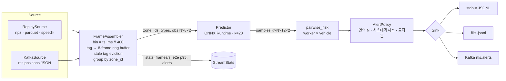

# 서빙 · 스트리밍 — API 계약, 충돌 위험 정의, 경보 정책, 스트리밍 구조

> 코드: `src/foresight/serving/{app,schemas,risk,stream}.py` · 부하 테스트: `scripts/locustfile.py` ·
> Kafka 연결: `scripts/replay_to_kafka.md` · 추론 백엔드 선택 근거: [`inference_optimization.md`](inference_optimization.md)

## 1. 한눈에

```
RTLS 태그(10 Hz) ─▶ Kafka/Redpanda(rtls.positions) ─▶ foresight stream ─▶ rtls.alerts ─▶ 현장 알림
                                                         │
                     ┌───────────────────────────────────┘
                     ▼
        FrameAssembler(0.4 s 빈, 태그별 8 프레임 링 버퍼, 구역별 그룹)
                     ▼
        Predictor(ONNX Runtime fp32, k=20)  →  pairwise_risk(작업자×차량)  →  AlertPolicy  →  Sink
```

같은 예측기를 **동기 HTTP API**(`foresight serve`)로도 노출한다. API 는 무상태(쿨다운 없음)이고,
연속 프레임·쿨다운이 있는 경보 정책은 스트리밍 소비자 안에서만 동작한다 — HTTP 요청 사이에는 "이전 프레임"이
정의되지 않기 때문이다.

## 2. HTTP API 계약

`foresight serve --backend {torch,onnx,onnx-int8} --port 8000` (기본 `onnx`). OpenAPI: `/docs`.

| 메서드 | 경로 | 역할 |
|---|---|---|
| GET | `/health` | 백엔드 이름, 모델 파일 경로·sha256, 웜업 여부, 파라미터 수, 스레드 |
| GET | `/metrics` | Prometheus: `foresight_request_latency_seconds{endpoint}` (히스토그램, 0.5 ms~1 s 버킷), `foresight_predictions_total{endpoint}`, `foresight_agents_per_request`, `foresight_requests_total{endpoint,status}`, `foresight_alerts_total` |
| POST | `/predict` | 에이전트별 12 스텝(4.8 s) 평균 궤적 + 스텝별 σ, ρ (+ 선택적으로 K 샘플) |
| POST | `/risk` | `/predict` + 작업자×차량 쌍 충돌 위험 + 임계 초과 쌍 |

### 입력 (공통, pydantic v2 · 위반 시 422)

```json
{
  "agents": [
    {"id": "worker-17", "type": 0, "obs": [[1.0, 2.0], [1.4, 2.0], [1.8, 2.1], [2.2, 2.1], [2.6, 2.2], [3.0, 2.2], [3.4, 2.3], [3.8, 2.3]]},
    {"id": "forklift-3", "type": 1, "obs": [[9.0, 2.5], [8.2, 2.5], [7.4, 2.5], [6.6, 2.5], [5.8, 2.5], [5.0, 2.5], [4.2, 2.5], [3.4, 2.5]]}
  ],
  "k": 20, "seed": 0, "include_samples": false
}
```

* `obs`: **정확히 8 점**(0.4 s 간격 = 3.2 s 관측) 의 절대좌표 [x, y] (m). 7 점·9 점·3-D 점·NaN → 422.
* `agents`: 1~200 명, `id` 유일. `type`: 0 작업자 / 1 차량.
* `k`: 0~100 (0 이면 평균 궤적만, 샘플링 생략). `seed` 를 주면 결과가 결정적이다.
* `/risk` 추가 필드: `d_safe`(m, 기본 1.0), `threshold`(기본 0.3), `deterministic`(평균 궤적만으로 판정).

### 예시 curl

```bash
curl -s localhost:8000/health | jq .

curl -s -X POST localhost:8000/risk -H 'content-type: application/json' -d '{
  "agents": [
    {"id": "worker-17", "type": 0, "obs": [[-3.0,0],[-2.6,0],[-2.2,0],[-1.8,0],[-1.4,0],[-1.0,0],[-0.6,0],[-0.2,0]]},
    {"id": "forklift-3", "type": 1, "obs": [[3.0,0],[2.6,0],[2.2,0],[1.8,0],[1.4,0],[1.0,0],[0.6,0],[0.2,0]]}
  ], "k": 20, "seed": 0, "d_safe": 1.0, "threshold": 0.3}' | jq .
```

응답(요약):

```json
{
  "pairs":  [{"worker_id": "worker-17", "vehicle_id": "forklift-3", "risk": 1.0, "ttc_s": 0.4, "min_dist_mean": 0.17}],
  "alerts": [{"worker_id": "worker-17", "vehicle_id": "forklift-3", "risk": 1.0, "ttc_s": 0.4, "min_dist_mean": 0.17}],
  "n_workers": 1, "n_vehicles": 1, "k": 20, "d_safe": 1.0, "threshold": 0.3, "backend": "onnx-fp32",
  "timing_ms": {"preprocess_ms": 0.12, "model_ms": 0.11, "postprocess_ms": 0.6, "risk_ms": 0.08, "total_ms": 1.1}
}
```

`/predict` 응답의 각 항목: `mean` (12×[x,y] 절대좌표), `sigma` (12×[σx,σy], 상대 변위 분포의 표준편차 m),
`rho` (12개 상관계수), `samples` (`include_samples=true` 일 때 K×12×2). 직렬화는 FastAPI 0.14x 의 기본 경로
(`response_model` → pydantic-core 가 JSON bytes 를 직접 생성) 를 쓴다 — 이 버전에서 `ORJSONResponse` 는 deprecated
이고 pydantic-core 직접 경로가 더 빠르다고 FastAPI 가 명시한다.

## 3. 충돌 위험 정의

에이전트 $i$ 의 미래 궤적 샘플을 $x_i^{(k)}(t),\ t=1..12,\ k=1..K$ 라 하자 (0.4 s 간격, 절대좌표).

$$
\mathrm{risk}(w, v) \;=\; \Pr\Big[\min_{t}\ \|x_w(t) - x_v(t)\| < d_\text{safe}\Big]
\;\approx\; \frac{1}{K}\sum_{k=1}^{K} \mathbb{1}\Big[\min_t \|x_w^{(k)}(t) - x_v^{(k)}(t)\| < d_\text{safe}\Big]
$$

* **같은 샘플 인덱스 $k$ 끼리** 짝짓는다. 샘플 $k$ 는 모델이 한 번에 뽑은 "하나의 미래"다 — 작업자 샘플 3 과
  차량 샘플 11 을 비교하면 서로 다른 미래를 섞는 것이라 확률의 의미가 사라진다. (평가 프로토콜의
  `best_of_k_joint` 와 같은 논리.) 그래서 $W \times V$ 쌍에 대해 $K \times W \times V \times 12$ 거리 텐서를 한 번에
  만든다 — $K=20, W=V=100$ 이어도 약 20 MB, numpy 브로드캐스트로 1 ms 대.
* $\mathrm{ttc}(w, v) = \mathbb{E}\big[\,t^\ast_k \cdot 0.4\ \big|\ \text{충돌}\,\big]$, $t^\ast_k = \min\{t : \|x_w^{(k)}(t)-x_v^{(k)}(t)\| < d_\text{safe}\}$ —
  충돌한 샘플들의 **최초 접근 시각** 평균. 충돌 샘플이 없으면 `null`. 사람이 반응할 시간이 얼마나 남았는지를 뜻한다.
* $\mathrm{min\_dist\_mean} = \frac{1}{K}\sum_k \min_t \|x_w^{(k)}(t)-x_v^{(k)}(t)\|$ — 임계 근처에서 "얼마나 아슬아슬한지".
* **결정적 변형** (`deterministic=true` 또는 `k=0`): 평균 궤적 $\mu$ 만 쓴다 ($K=1$, risk ∈ {0, 1}). 샘플링 비용
  (전체 지연의 절반 가까이, `inference_optimization.md` 참조)이 없고, 분포가 좁을 때는 MC 와 같은 답을 준다.
  `/risk` 요청에 이 옵션이 있는 이유다.

`d_safe` 기본 1.0 m 는 RTLS near-miss 라벨 정의(`cli.md`)와 같다. UWB 위치 오차 σ≈0.15 m 를
감안하면 0.7 m 이하로 낮추는 것은 의미가 없다.

**오프라인 평가에서의 양성 정의** (`foresight.eval.collision`): 예측 시점에 d_safe 밖에 있던 (작업자, 차량) 쌍이 4.8 s 안에
d_safe 안으로 들어오면 양성. 예측 시점에 이미 d_safe 안인 쌍은 "사전 경보"의 대상이 아니므로 평가에서 제외하고 개수만 보고한다.
부분 샘플(`--every k`) 평가의 오경보/시간은 1/k 로 외삽한다.

## 4. 경보 정책 (`AlertPolicy`)

```python
AlertPolicy(threshold=0.3, cooldown_s=5.0, min_consecutive=2, clear_threshold=None  # → threshold/2
```

쌍 `(worker_id, vehicle_id)` 마다 상태(연속 카운터, 마지막 경보 시각)를 둔다.

| 규칙 | 동작 | 왜 |
|---|---|---|
| 연속 N 프레임 | risk ≥ threshold 인 프레임이 `min_consecutive` 번 **연속**일 때만 경보 | 0.4 s 마다 새 예측이 나오므로 한 프레임 튐(태그 노이즈, 샘플링 요동)으로 울리면 오경보가 잦다. PPE 검출 프로젝트에서 "연속 N 프레임" 이 오경보를 크게 줄였던 경험을 옮겼다 |
| 히스테리시스 | `clear_threshold ≤ risk < threshold` 이면 카운터를 **유지**, `clear_threshold` 아래로 내려가야 리셋 | 임계 근처에서 0.29 ↔ 0.31 로 진동하는 쌍이 매번 카운터를 잃고 영영 경보하지 못하는 것을 막는다 |
| 쿨다운 | 한 쌍에 경보한 뒤 `cooldown_s` 동안 같은 쌍은 억제 (`n_suppressed` 로 집계) | 12 프레임(4.8 s) 동안 같은 상황이 이어지면 12 번 울린다 — 현장 알림은 한 번이면 된다 |
| 상태 GC | `stale_after_s`(60 s) 동안 안 보인 쌍의 상태 삭제 | 태그가 수백 개면 쌍 상태가 무한히 자라므로 상한이 필요하다 |

관측에 없는 쌍은 상태를 건드리지 않는다 — 한 프레임 태그가 끊겨도 카운터가 유지된다.
경보 JSON (stdout/file/kafka 공통):

```json
{"worker_id": "s12a0", "vehicle_id": "s12a1", "risk": 0.85, "ttc_s": 1.2, "min_dist_mean": 0.61, "ts_s": 21.6,
 "zone_id": 12, "consecutive": 2, "ts_ms": 21600, "backend": "onnx-fp32"}
```

## 5. 스트리밍 소비자 구조



* **빈 단위 처리**: 태그는 10 Hz 로 비동기 도착하지만 모델은 0.4 s 간격 8 점을 본다. `ts_ms // 400` 으로 빈을
  나누고 빈마다 태그의 마지막 샘플을 취해 2.5 Hz 로 다운샘플한다(학습 데이터와 같은 주기). 한 빈이 닫힐 때
  한 번만 예측하므로 구역당 예측은 태그 수와 무관하게 초당 2.5 회.
* **완성 조건**: 링 버퍼 8 개가 **연속 빈**(현재 빈에서 끝남)일 때만 예측한다. 중간 결손이 있으면 그 태그는
  건너뛴다 — 보간해 넣으면 상대 변위(모델 입력)가 0 이 되어 "정지" 로 오해된다.
* **구역 단위 그래프**: 인접행렬이 N² 이고 멀리 떨어진 태그는 서로 영향이 없다. 공장 전체 대신 `zone_id` 별
  그래프를 만든다. 작업자·차량이 모두 있는 구역만 예측한다(둘 중 하나만 있으면 경보가 나올 수 없다).
* **비용**: 벤치마크의 "프레임당 Z 구역" 워크로드 — 구역 하나(N=10, k=20, 위험 계산 포함) ≈ 1.6 ms p95
  (ORT fp32, 1 스레드; 8 구역 프레임 p95 12.9 ms) → 소비자 하나가 2.5 Hz 예산(400 ms) 안에 ~248 구역을 처리할 수 있다
  (`results/benchmark.json` → `streaming`).

### 실행

```bash
# 파일 재생 (ETH/UCY 에는 차량이 없으므로 홀수 에이전트를 차량으로 간주해 경보 경로를 검증한다)
foresight stream --source replay --replay-file data/processed/ethucy/zara1/test.npz --speed 50 --max-seconds 10 --sink stdout
# RTLS parquet (ts_ms, tag_id, agent_type, zone_id, x, y) 도 같은 명령으로 재생된다
foresight stream --source replay --replay-file data/rtls/long.parquet --speed 1 --sink file
# Kafka
foresight stream --source kafka --bootstrap localhost:9092 --topic rtls.positions --sink kafka --alerts-topic rtls.alerts
```

종료 시 통계를 로그로 남긴다: `frames`, `zones_evaluated`, `agents_predicted`, `alerts`, `frames_per_s`,
`e2e_p50_ms`, `e2e_p95_ms`. 테스트(`tests/test_stream.py`)는 zara1 테스트 분할을 50 배속으로 10 초 재생해
경보가 나오고 `e2e_p95_ms < 400` 임을 확인한다.

## 6. Kafka / Redpanda 로 바꾸기

`scripts/replay_to_kafka.md` 에 Redpanda 컨테이너 기동 → 토픽 생성 → 파일을 JSON 메시지로 흘리는 생산자
예시 → `--source kafka` 소비자 실행 순서가 있다. 요점:

* 메시지: `{"ts_ms": 1726600000400, "tag_id": "W-17", "agent_type": 0, "zone_id": 3, "x": 12.3, "y": 4.5}`.
* **파티션 키 = `zone_id`**: 같은 구역의 태그가 같은 파티션 → 같은 소비자로 가야 `FrameAssembler` 가 구역
  그래프를 온전히 본다. 소비자를 늘리려면 파티션 수 ≥ 소비자 수.
* `confluent-kafka` 는 선택 의존성(`pip install 'rtls-foresight[stream]'`). 없으면 `KafkaSource` 는 설치 안내와
  함께 즉시 실패하고, `--sink kafka` 는 stdout 으로 내려간다. 파일 재생 경로는 의존성 없이 항상 동작한다.

## 7. 백프레셔 · 운영 메모

* **재생 소스**: 처리가 프레임 간격(400 ms / speed)보다 느리면 잠들지 않고 바로 다음 프레임을 낸다 —
  프레임을 버리지 않고 재생이 실시간보다 느려질 뿐이다. `frames_per_s` 가 `2.5 × speed` 보다 낮으면 그 상태.
* **Kafka 소스**: 처리 지연은 컨슈머 랙으로 나타난다. `e2e_p95_ms` 가 빈 간격(400 ms)에 가까워지면
  (1) 구역을 더 잘게 파티션하고 소비자를 늘린다, (2) `k` 를 20 → 10 으로 줄이거나 결정적 경로로 바꾼다
  (후처리 샘플링이 지연의 절반이다), (3) 작업자·차량이 함께 있는 구역만 예측하는 현재 규칙을 유지한다.
* **빈 강제 마감**: 생산자가 멈추면 마지막 빈이 영원히 열려 있을 수 있어 `flush_after_s`(1 s) 뒤 강제로 닫는다.
* **태그 만료**: `stale_bins`(3 빈 = 1.2 s) 동안 안 보인 태그는 버린다. RTLS 드롭아웃(수 프레임)보다 길고,
  구역을 떠난 태그를 오래 붙들지 않을 정도로 짧다.
* **HTTP 서버**: 엔드포인트는 동기 `def` → Starlette 스레드풀에서 병렬 실행. ORT 세션은 스레드 안전.
  `FORESIGHT_THREADS`(기본 1) 로 intra-op 스레드를 정한다 — 이 모델은 1 스레드가 가장 빠르고, 코어는 워커
  프로세스(`--workers`) 로 쓰는 편이 낫다 (`inference_optimization.md` §스레드).
* **torch 스레드는 백엔드와 무관하게 1 로 고정한다.** ONNX 백엔드도 후처리(K 샘플 추출)는 torch 로 돌기 때문에
  `OnnxPredictor(torch_threads=1)` 가 `torch.set_num_threads(1)` 을 건다. 이걸 빼먹었을 때 실제로 겪은 회귀:
  핸들러 시간이 1.7 ms → 25 ms (OpenMP 스핀 대기, 벤치마크 문서 §3). torch 백엔드로 서빙한다면 추가로
  `OMP_WAIT_POLICY=PASSIVE` 를 컨테이너 환경변수에 넣는다.

## 8. 부하 테스트 (locust)

`scripts/locustfile.py`: `POST /risk` (에이전트 5~20 명, 1/3 차량, 한 쌍은 정면 접근시켜 경보 경로 포함, k=20) 8 :
`POST /predict` 1 : `GET /health` 1. 실행: `locust -f scripts/locustfile.py --headless -u 20 -r 20 -t 30s --host http://127.0.0.1:8000`.

### 측정 (이 머신: 4 vCPU Xeon 2.80 GHz, uvicorn 워커 1, 백엔드 onnx-fp32, ORT·torch 각 1 스레드)

| 실행 | 요청 수 / 실패 | 총 RPS | `/risk` RPS | `/risk` p50 | `/risk` p95 | `/risk` p99 |
|---|---|---|---|---|---|---|
| locust 20 users, 30 s | 5,126 / 0 | **170.6** | **137.3** | 82 ms | **210 ms** | 310 ms |
| 1 user 순차 (httpx, N=10, 300 회) | 300 / 0 | – | – | 4.2 ms | 7.4 ms | 8.7 ms |
| 1 user 순차, 핸들러 내부 `timing_ms.total_ms` (N=5 / 10 / 20) | – | – | – | 1.7 / 2.0 / 3.6 ms | – | – |

읽는 법 — 왜 1.4 ms 짜리 파이프라인이 부하 아래서 82 ms 로 보이는가:

* **측정 환경**: 벤치마크와 같은 시점에 학습 프로세스 3 개(각 1 스레드)가 4 vCPU 중 3 개를 쓰고 있었고, locust
  (파이썬, 20 사용자)도 같은 머신에서 돌았다. 서버가 실제로 쓴 코어는 1 개 미만이다.
* **한 요청의 진짜 지연**은 순차 실행의 p50 **4.2 ms** (HTTP 왕복 + 검증 + 파이프라인 + 직렬화) 이고, 그중 핸들러
  내부(전처리·모델·샘플링·위험)가 2.0 ms — 나머지 2 ms 가 HTTP 파싱, pydantic 검증(10 명 × 8 점), 응답 모델 생성이다.
* **서버 측 히스토그램** (`foresight_request_latency_seconds{endpoint="/risk"}`, 20 users): count 5,037, sum 120.4 s →
  핸들러 평균 **24 ms**. 순차의 2 ms 가 부하에서 24 ms 가 되는 것은 동기 엔드포인트 20 개가 스레드풀에서 **GIL 을
  번갈아 잡으며** 동시에 진행되기 때문이다 — 한 요청의 벽시계 시간에 다른 19 개의 파이썬 구간이 끼어든다.
  처리량 171 req/s 는 요청당 CPU ≈ 5.9 ms 를 뜻한다 (파이프라인 2 ms + HTTP/검증/직렬화 2 ms + 스레드 전환·locust 경합).
* 따라서 **확장 축은 스레드가 아니라 프로세스**다: `foresight serve --workers 4` (uvicorn 멀티프로세스) 로 코어당
  워커 하나. 이 모델은 워커당 1 스레드가 최선이므로(`inference_optimization.md` §3) 코어 = 워커 수가 된다.
  유휴 4 코어 머신이면 4 워커 × ~170 req/s ≈ 600~700 req/s 급을 기대할 수 있다 (미측정 — 학습 종료 후 재측정 필요).
* **회귀 기록**: 첫 부하 테스트는 총 128 req/s, `/risk` p50 150 ms 였고 순차 핸들러 시간이 25 ms 였다. 원인은 ONNX
  백엔드에서 torch 스레드 수를 고정하지 않아 후처리(torch 샘플링)가 4 스레드 OpenMP 스핀 대기에 걸린 것
  (§7). `OnnxPredictor(torch_threads=1)` 로 고친 뒤 핸들러 2 ms, 처리량 171 req/s 가 위 표다.
* 실패 0 건, 검증 오류 0 건 — 부하 중에도 `/health` 가 40 ms 대로 응답해 readiness probe 로 쓸 수 있다.
